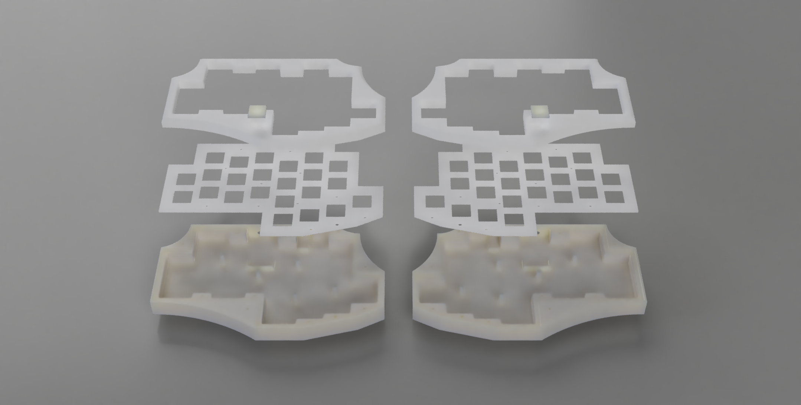
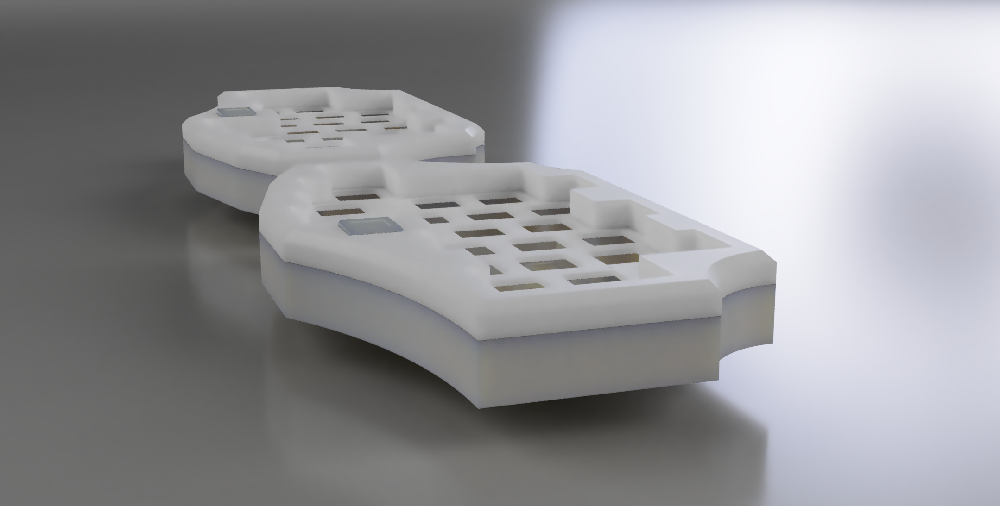

# wire-morpho

 Created and designed by: Fabian.S || ScatteredDrifter 

  
A hardwired 23 key split-keyboard with a bottom-mount case and badge support 

|| fully 3d printable

## Features: 
- simple brackets to mount the pro micro 
- bottom mount 
- top casing with chamfers 
- holes for 3.6mm Trs jacks

##Planned Features: 
 - **#** print new revision of case for updated showcase 
 - **#** QMK Support - works with Pinky/rev3 already 
 - add support for unified daughterboards > USB-C 
 -  improve mounting system 
 - add options for a pcb 
 - provide plate files > dxf,svg 
 
##Images:
<b>first complete build with 46x Gateron Yellows (205G), PBT Cherries, 2x Pro Micros

Old revision without a working badge design: 
</b>
**Side-view:**

**Top-view**

###Renders ( Fusion 360):

 

**||| - Glory To Mankind**