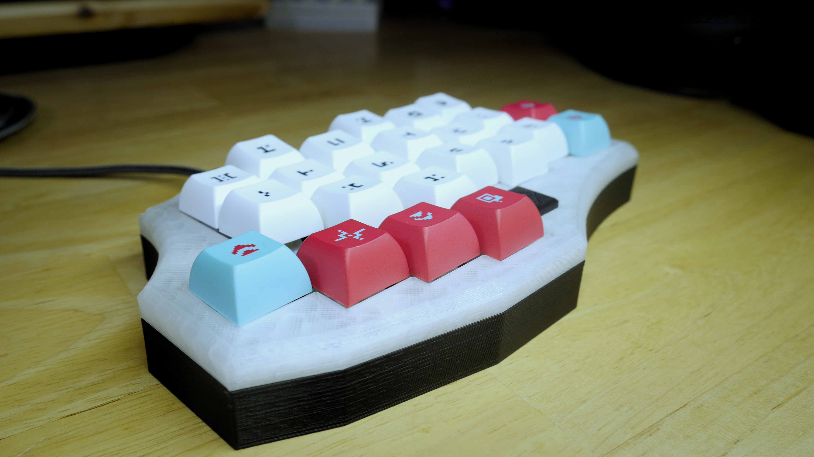
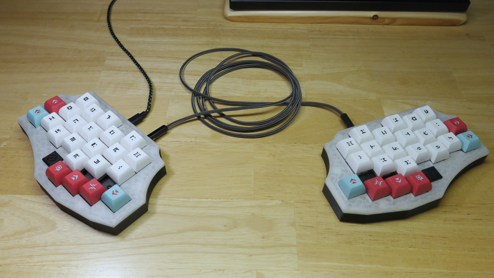
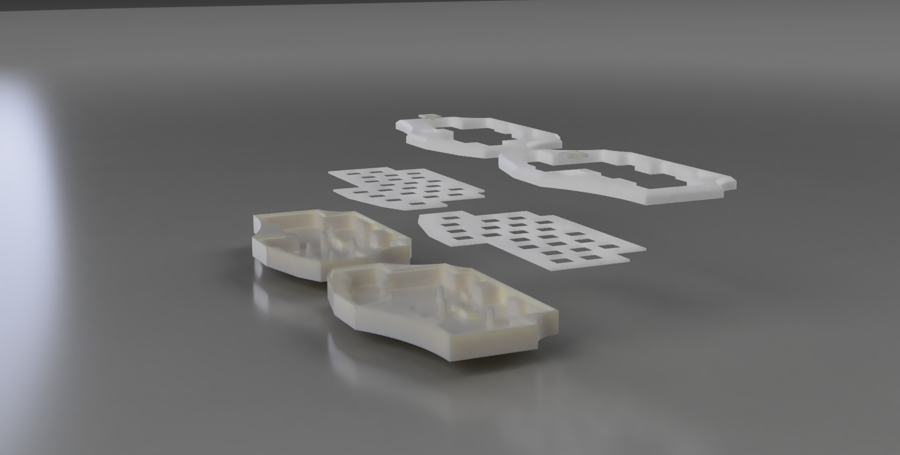

# Scattered-credence

 Created and designed by: Fabian.S || ScatteredDrifter 
    A hardwired 23 key split-keyboard with a bottom-mount case and badge support

|| fully 3d printable

## Features:

* simple brackets to mount the pro micro
* bottom mount
* top casing with chamfers
* holes for 3.6mm Trs jacks

## Planned Features:

- nothing, wont update this thing anymore, its awful
## Images:
<b>new iteration with working badge:</b>

--- 

<b>first complete build with 46x Gateron Yellows (205G), PBT Cherries, 2x Pro Micros

Old revision without a working badge design: </b> **Side-view:** 

**Top-view** 

<b>new revision of the top casing, without a badge attached </b>

**Top-view** 
### Renders ( Fusion 360):

 **||| - Glory To Mankind**
